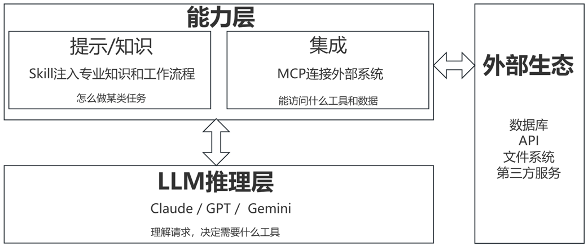
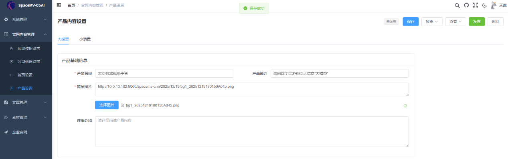
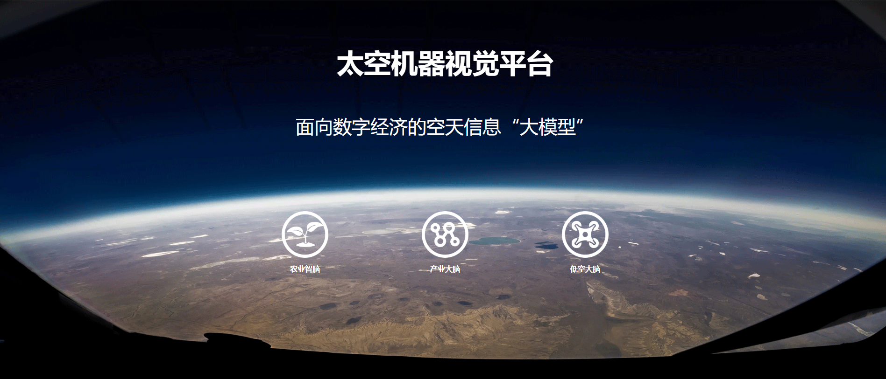
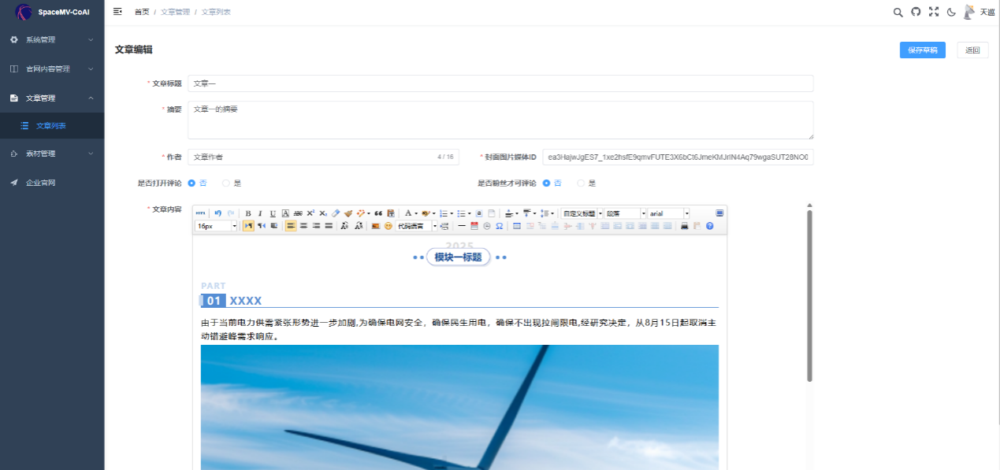
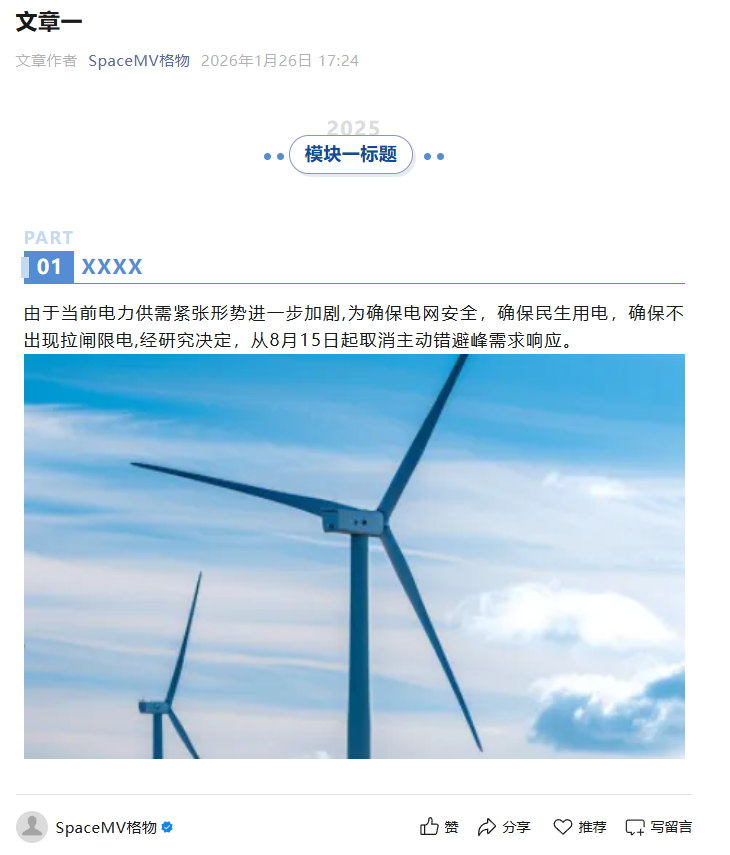
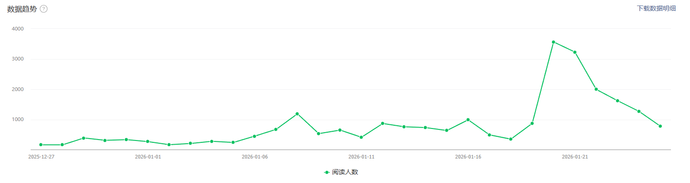
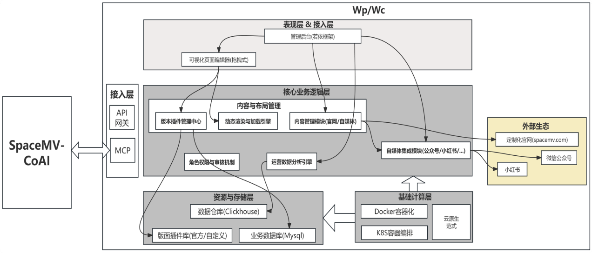

# SpaceMV-CoAI-Wp/Wc
(Industrial Planet Operations AI Agent — Content Production and Maintenance Tool)

## 1 The Vision of SpaceMV-CoAI

### (1) The Role of SpaceMV-CoAI:
Industrial Planet Chief Operating Officer (COO).

### (2) The Vision of SpaceMV-CoAI:
Even the smallest individual has its own planet.

### (3) The Core of SpaceMV-CoAI:
**Cooperation**: Managing AI Agents just like managing junior employees.

> **Note**: As a COO responsible for Vercel's global business, Jeanne is highly focused on AI efficiency enhancement. She proposed a very interesting viewpoint: managing AI Agents does not require a brand-new set of skills; it is actually a return to the basics of management.
>
> "The core skill of managing AI agents is, in fact, exactly the same as managing those junior employees who need clear instructions, feedback, and correction." —— Jeanne DeWitt Grosser
>
> She suggests that when teams introduce AI tools, they should provide clear context, explicit goals, and room for error, just like conducting onboarding training for a newcomer. Within Vercel, they do not blindly believe in off-the-shelf AI tools but emphasize customization and fine-tuning based on the enterprise's private code/data, because "generic AI will never solve deep-seated problems."

### (4) The Goal of SpaceMV-CoAI:

According to the definition by APICS (American Production and Inventory Control Society, now renamed ASCM, Association for Supply Chain Management), operations management is the process of planning, scheduling, and controlling activities that transform inputs into finished products and services.

SpaceMV-CoAI will assist enterprises in achieving intelligent transformation in areas such as strategic conversion and operations planning, system construction and efficiency improvement, and organizational synergy and team empowerment:

*   **First, Content Production and Maintenance Tool**: A one-stop service for content production, review, publishing, monitoring (traffic monitoring/security monitoring such as anti-tampering), statistics, analysis (diagnosis), and feedback (quality/performance evaluation) for enterprise official websites and self-media;
*   **Second, Industrial Planet**: Access to SpaceMV-ScAI (constellation intelligent management platform developed by Chengdu Tianxun Micro-Satellite Technology Co., Ltd., GitHub address: https://github.com/tianxunweixiao/SpaceMV-ScAI) for one-click publishing of transit forecasts, coverage analysis, etc. for key industrial parks;
*   **Third, Industrial Dashboard**: Usually refers to a visualization tool for monitoring and analyzing the operation status of specific industries, including but not limited to industry-specific dashboards, operation dashboards, supply chain dashboards, cross-industry correlation dashboards, etc. By integrating key data indicators, it supports users in customizing chart combinations, conducting data comparison, correlation analysis, and historical backtesting to assist investment and business decisions;
*   **Fourth, Interactive Industrial Map**: A digital tool combining Geographic Information System (GIS), spatio-temporal big data, and interactive technology. By integrating real-time data such as enterprise distribution, industrial scale, innovation resources, etc., it upgrades traditional static maps to dynamic "live maps", supporting users in multi-dimensional retrieval by industry category, region, or function positioning to accurately query industrial layout, assist in formulating industrial policies, optimize spatial layout, and guide resource agglomeration; covering planning, policies, parks, enterprises, human resources and other types of data, building a global industrial "one map" to help users compare industrial structure and resource endowments across regions, assisting enterprises in precise site selection, market expansion, and reducing investment risks; supporting user independent operations such as zooming, switching layers, and associated queries, integrating policy query, resource docking and other functions to provide real-time industrial information.

The technical logic diagram of SpaceMV-CoAI is shown in the figure below:

*(Figure 1: SpaceMV-CoAI Technical Logic Diagram)*

## 2 Introduction to SpaceMV-CoAI-Wp/Wc

SpaceMV-CoAI-Wp and SpaceMV-CoAI-Wc are two MCP applications within the SpaceMV-CoAI product ecosystem. They address the challenges marketing teams face in enterprise content marketing, such as time-consuming multi-platform distribution, fragmented operational data insights, and complex, inefficient content review processes.

### ■ SpaceMV-CoAI-Wp: Official Website Content Management, Flexible Control of Brand Facade

SpaceMV-CoAI-Wp is the content hub for the official website of Chengdu Tianxun Micro-Satellite Technology Co., Ltd. (http://spacemv.com/). It provides intuitive and powerful content editing functions while offering flexible page layout requirements based on a plugin-based architecture, allowing you to easily achieve:

*   **Plugin-based Layout Design**: Every official website layout style is designed as an independent Plugin.
*   **Fully Customizable**: SpaceMV-CoAI-Wp supports users in importing these plugins and performing full editing and customization of page layouts, styles, and content. You are no longer limited to the fixed page styles of Chengdu Tianxun Micro-Satellite Technology Co., Ltd. and can design freely according to brand tone.
*   **Rich Plugin Library**: SpaceMV-CoAI-Wp will provide a series of pre-customized layout plugins for users to choose from, achieving a perfect combination of "out-of-the-box" and "deep customization."
*   **Image and Text Replacement**: Quickly update product images, event posters, and text information.
*   **Real-time Publishing**: Ensure that the official website content always stays up-to-date, delivering the brand voice to users at the first opportunity.

*(Figure 2: SpaceMV-CoAI-Wp Editing "Product Settings" Page)*

*(Figure 3: Adaptive Rendering of the Corresponding Official Website Page)*

### ■ SpaceMV-CoAI-Wc: One-stop Creation and Efficient Distribution for Self-media

For marketing teams, SpaceMV-CoAI-Wc completely revolutionizes the self-media operation mode. Imagine no longer needing to frequently log into multiple platforms like WeChat Official Accounts and Xiaohongshu to repeat image/text editing and typesetting.

*   **Unified Creation Platform**: Creators only need to complete image/text editing once in SpaceMV-CoAI-Wc to adapt to the publishing requirements of multiple self-media platforms.
*   **Role-based Review Mechanism**: Built-in rigorous role permissions and review processes ensure that every post is reviewed by company leaders or designated personnel, guaranteeing content quality and brand safety.
*   **Efficient Operation and Timeliness**: Whether it is publishing an article or an emergency takedown, SpaceMV-CoAI-Wc can achieve one-click synchronization. This greatly reduces the time and labor costs of multi-platform operations, making your content operations more timely and controllable.

*(Figure 4: SpaceMV-CoAI-Wc Writing a WeChat Official Account Article)*

*(Figure 5: Corresponding Article on WeChat Official Account)*

In addition to content management, SpaceMV-CoAI-Wp/Wc integrates operational data analysis capabilities:

*   **Multi-dimensional Metric Tracking**: Real-time tracking of follower growth metrics across various self-media platforms.
*   **Quantified Traffic Attraction Effect**: Precisely analyze the traffic attraction metrics of self-media posts to evaluate the actual effect of content marketing.
*   **Advertising Marketing Insights**: Provide data support for self-media advertising marketing activities and optimize placement strategies.

*(Figure 6: Operation Analysis Example - WeChat Official Account Readership Report)*

## 3 Architectural Analysis of SpaceMV-CoAI-Wp/Wc

From a technical implementation perspective, SpaceMV-CoAI-Wp/Wc mainly focuses on the following three areas:

### Architecture Focus 1: Technology Selection and Cloud-Native Form
*   **Core Framework**: SpaceMV-CoAI-Wp/Wc is developed based on the mature and stable **RuoYi framework** in China, ensuring rapid system iteration and high maintainability.
*   **Cloud-Native Design**: Technically, we fully adhere to cloud-native concepts. The system uses Docker containerization for deployment and runs on the **K8S container orchestration framework**, which enables SpaceMV-CoAI-Wp/Wc with dynamic service scaling and high-reliability operation capabilities to easily handle traffic peaks.

### Architecture Focus 2: Innovative Plugin-based Architecture for Dynamic Page Construction
To achieve full customization of the official website layout, we introduced an innovative plugin-based architecture:

*   **Layout Plugin Management Center (PluginMgr)**: Responsible for managing all layout plugins imported by users and provided officially, including plugin configuration, version control, and permission management.
*   **Dynamic Rendering and Loading Engine (DynamicLoader)**: This is the core of achieving customization. It can dynamically load required plugins based on the user's layout configuration in the backend and perform real-time rendering combined with content data, ultimately presenting a completely personalized official website page.

### Architecture Focus 3: Data Warehouse Mechanism Supporting Deep Analysis
To achieve deep mining and historical analysis of operational data, SpaceMV-CoAI-Wp/Wc innovatively integrates a **Data Warehouse** mechanism:

*   **Native Data Scraping**: The system can scrape native data from various self-media platforms, ensuring the accuracy and integrity of data sources.
*   **Empowered by Clickhouse**: We selected the high-performance columnar storage database **Clickhouse** as the data warehouse database. It can support historical and real-time analysis across different themes and dimensions, providing second-level response data support for your operational decisions.

### Architecture Focus 4: MCP Empowering Agent Employees
Through **MCP (Model Context Protocol)** encapsulation, it can be integrated as Tools into SpaceMV-CoAI to achieve:

*   **Internal Digital Operations Employee of Chengdu Tianxun Micro-Satellite Technology Co., Ltd.**: Through semantic interaction, the AI Agent automatically completes various operations of self-media content management.
*   **Third-party Integration**: Any third-party AI Agent platform following the MCP protocol can easily integrate and call the content management and data analysis capabilities of SpaceMV-CoAI.

*(Figure 7: SpaceMV-CoAI-Wp/Wc Architecture Diagram)*

## 4 Current Version Features

| Functional Module | Core Content |
| :--- | :--- |
| **Official Website Content Management of Chengdu Tianxun Micro-Satellite Technology Co., Ltd.** | Supports flexible content editing referencing the style of the company's official website (http://spacemv.com/) |
| **WeChat Official Account Article Publishing Integration** | Supports material management, article editing, review, and publishing benchmarked against WeChat Official Accounts |

## 5 Recent Plans

### (1) Recent Plans for SpaceMV-CoAI-Wp/Wc
The release of SpaceMV-CoAI-Wp/Wc is just the beginning. We have planned a clear subsequent functional roadmap to continue bringing more value to users.

| Process/Category | Functional Milestone | Core Content | Estimated Release Time |
| :--- | :--- | :--- | :--- |
| **Production** | Interactive Data Report Embedding in Posts | Supports editing and publishing self-media posts with embedded interactive data reports, achieving one-click generation of data visualization content | Early April 2026 |
| **Production** | Official Website Layout Pluginization | Achieves full customization of official website layout, supporting plugin import and full editing/customization of page layout/style + content | May 2026 |
| **Monitoring** | Monitoring Tools/Agents | Provides security capabilities such as traffic monitoring and page anti-tampering in the form of Tools/Agents, capable of real-time collection and analysis of traffic behavior and page integrity verification, with automatic alerts upon detecting anomalies | TBD |
| **Statistics** | Data Dashboards | Supports official website browsing data dashboards and traffic/audience data analysis for self-media posts | February 2026 |
| **Analysis (Diagnosis)** | Content Analysis Tools/Agents | Based on content and operational data, provides functions like automatic analysis of article propagation patterns and user interaction attribution to locate high-value content characteristics in the form of Tools/Agents, providing data basis for content strategy optimization | TBD |
| **Feedback (Quality/Performance Evaluation)** | Quality/Performance Evaluation Tools/Agents | Provides evaluation of article quality (originality, compliance, propagation power, etc.) and generates quantified performance scores for operators based on volume, interaction, and conversion data in the form of Tools/Agents, supporting content optimization and personnel assessment | TBD |
| **Ecosystem** | Xiaohongshu Deep Integration | Supports Xiaohongshu platform integration and data dashboard analysis, comprehensively covering mainstream self-media platforms | March 2026 |

### (2) Recent Plans for SpaceMV-CoAI
From a global perspective, SpaceMV-CoAI will advance core upgrades around capability encapsulation, tool-based output, and scenario implementation.

| Functional Milestone | Core Content | Estimated Release Time |
| :--- | :--- | :--- |
| **SpaceMV-CoAI MCP Encapsulation Completed** | Formulate MCP specifications for SpaceMV-CoAI, complete MCP encapsulation for modules like Wp/Wc, support SpaceMV-CoAI calls, and officially provide AI Tool services externally | Late April 2026 |
| **SpaceMV-CoAI V1.0.0 Online** | Integrate SpaceMV-CoAI-Wp/Wc capabilities to launch SpaceMV-CoAI V1.0.0. 1. **Content Operations Agent Online**: Autonomous services for production, review, publishing, monitoring, statistics, analysis, and feedback for official websites and self-media. 2. **Interactive Dashboard Agent Online**: One-click publishing to Website/WeChat/Xiaohongshu. 3. **Interactive Map Agent Online**: One-click publishing to Website/WeChat/Xiaohongshu. | TBD |
| **SpaceMV-ScAI One-click Publishing** | Access to SpaceMV-ScAI (constellation intelligent management platform) for one-click publishing of transit forecasts, coverage analysis, etc. for key industrial parks. | TBD |

## 6 Open Source Addresses

SpaceMV-CoAI follows the **MIT open source license**. Developers and researchers in related fields are welcome to follow, use, and contribute code.

*   **SpaceMV-CoAI Repository**: [https://github.com/tianxunweixiao/SpaceMV-CoAI](https://github.com/tianxunweixiao/SpaceMV-CoAI)
*   **SpaceMV-CoAI-Wp/Wc Backend Repository**: [https://github.com/tianxunweixiao/SpaceMV-CoAI-WpWc-Backend](https://github.com/tianxunweixiao/SpaceMV-CoAI-WpWc-Backend)
This repository is the shared backend repository for SpaceMV-CoAI-Wp/Wc Frontend, SpaceMV-CoAI-Wp (Official Website) PC End, and SpaceMV-CoAI-Wp (Official Website) Mobile End.

*   **SpaceMV-CoAI-Wp/Wc Frontend Repository**: [https://github.com/tianxunweixiao/SpaceMV-CoAI-WpWc-Frontend](https://github.com/tianxunweixiao/SpaceMV-CoAI-WpWc-Frontend)
*   **SpaceMV-CoAI-Wp (Official Website) PC Repository**: [https://github.com/tianxunweixiao/SpaceMV-CoAI-Wp-PC-Frontend](https://github.com/tianxunweixiao/SpaceMV-CoAI-Wp-PC-Frontend)
*   **SpaceMV-CoAI-Wp (Official Website) Mobile Repository**: [https://github.com/tianxunweixiao/SpaceMV-CoAI-Wp-Mobile-Frontend](https://github.com/tianxunweixiao/SpaceMV-CoAI-Wp-Mobile-Frontend)
